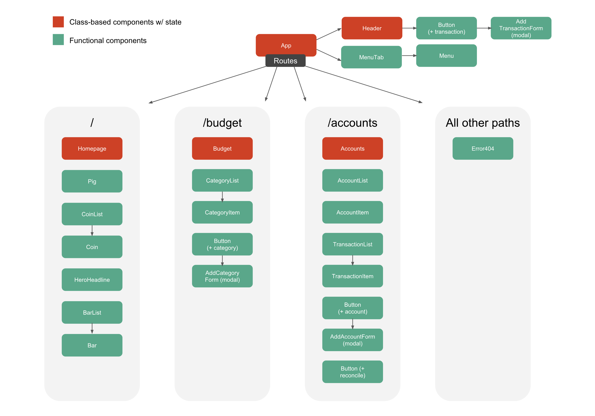

# Intentional Money

#### Budgeting app built in React, 3.1.19

#### By Kristin Brewer-Lowe

## Description

This is a budgeting app where users can create a budget, add accounts and track all transactions. Users can log in using their Google credentials. 

## Site Plan

* A visual representation of the layout/appearance [here](https://docs.google.com/presentation/d/1A02e9nJZqEkrIvFPrJaV8hc0JglVK82m05_LCetHxVU/edit?usp=sharing).

* Component structure:




## Setup/Installation Requirements

* Clone this project with `git clone https://github.com/klowe27/intentional-money`
* Run `npm install` to install dependencies
* To run this project locally, you must first create a Firebase account. Create a firebaseConfig.js file stored in in the root directory, and add your account credentials like this:
  ```
  export const firebaseConfig = {
    apiKey: "FIREBASE-API-KEY",
    authDomain: "XXX",
    databaseURL: "XXX",
    projectId: "XXX",
    storageBucket: "XXX",
    messagingSenderId: "XXX"
  }
  ```
* Run `npm run start` to build and serve the project
* View the project in any browser at `http://localhost:8080/`

## Known Bugs

There are no known bugs at this time.

## Support and contact details

If you discover a bug or would like to make a suggestion, email me at kristin.lowe1@gmail.com.

## Technologies Used

React, Javascript, Firebase, Firebase authentication, Babel, Webpack.

### License

This software is licensed under the MIT license.

Copyright (c) 2019 **Kristin Brewer-Lowe**
